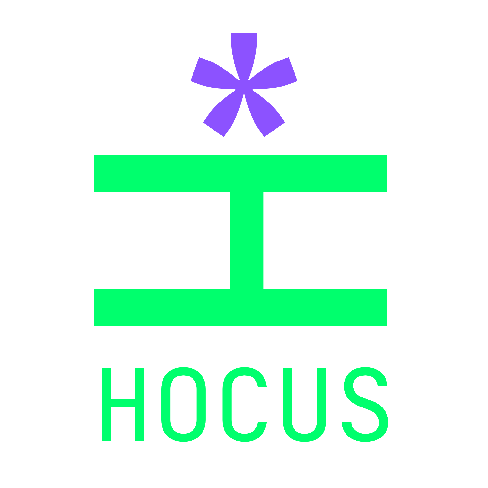

# Hocus

<p align="center">
  
</p>

A multi-agent harness generator and interactive command deck for AI coding tools. Write one persona once — a `SOUL.md` file — and compile it into native agent and rule formats for **Claude Code**, **OpenCode**, **Cursor**, **Antigravity**, **Command Code**, and **GitHub Copilot**.

The cast that ships with Hocus is 13 role-based personas — `planner`, `orchestrator`, `reviewer`, `feature-dev`, `founder`, and so on — authored under `src/personas/` as `planner.soul.md`, `orchestrator.soul.md`, etc. At `hocus init`, each role is compiled into either **Silicon Valley** names (Richard, Jared, Gilfoyle…) or **Wizard** names (Merlin, Roger Bacon, Zoroaster…). Each persona keeps `aliases` for both conventions — toggle them on the dashboard with `?cast=valley` or `?cast=occult`. Rename or replace any persona — the harness doesn't care what an agent is called, only that it has a role, a voice, and a body of instructions.

---

## Choosing a cast: Silicon Valley vs. Wizards

Hocus ships one logical cast — 13 roles — with two naming conventions. The choice is cosmetic but it touches file names, skill IDs, slash commands, and the default display in compiled outputs and the dashboard. The harness behavior is identical either way; only the names change.

Implementation lives in `src/utils/cast.ts:1` (`CAST_MAP`, `PERSONA_SKILL_IDS`, `transformSoulForCast`, `transformSkillFrontmatterForCast`, `getSoulFilenameForCast`) and is wired through `src/commands/init.ts:200` (`resolveCast`, `promptForCast`, migration logic) and `src/templates/dashboard.ts:1` (client-side toggle).

### How you choose

| Mode | What happens |
|---|---|
| **Interactive** (`hocus init` in a TTY) | Prompt: `1) Silicon Valley — Richard, Jared, Gilfoyle, Dinesh...` / `2) Wizards — Merlin, Roger Bacon, Zoroaster, Flamel...` (`src/commands/init.ts:260`). Default is `2` (Wizards) if you press Enter or enter an unrecognized value. |
| **Flag** | `hocus init --cast valley` or `hocus init --cast wizard` (also accepts `silicon`, `silicon valley`, `sv`, `occult`, `hocus`, `mystic` — see `normalizeCast` in `src/utils/cast.ts:8`). `--cast` bypasses the prompt and logs `using … cast (--cast …)`. |
| **Non-interactive / `--dry-run`** | No prompt. Defaults to Wizards (`src/commands/init.ts:240`). Pass `--cast` explicitly to force Valley in CI. |

The choice is persisted in `.hocus/config.json` as `{ "cast": "valley" | "wizard" }`. `hocus cast` and `hocus sync` read the personas on disk; `hocus init` reads the config to detect an existing cast before deciding whether to migrate (`src/commands/init.ts:300`).

### What changes when you pick a cast

#### 1. Persona files (`.hocus/personas/*.soul.md`)

The bundled sources under `src/personas/` use **role-based filenames** (`planner.soul.md`, `orchestrator.soul.md`, `reviewer.soul.md`, `founder.soul.md`, …). Each file carries a `role` field and a cast-specific `character` slug in frontmatter, plus `aliases` for both naming conventions. Role slugs map to cast keys via `BASE_AGENT_TO_VALLEY` in `src/utils/cast.ts` (e.g. `planner` → `richard`, `orchestrator` → `jared`, `reviewer` → `gilfoyle`).

At `hocus init` time each file is transformed for the chosen cast (`transformSoulForCast` in `src/utils/cast.ts`):

- **Valley**: installed filename is the valley slug (`richard.soul.md`, `gilfoyle.soul.md`, `jared.soul.md`, `peter-gregory.soul.md`, `jian-yang.soul.md`, `big-head.soul.md`, …) via `getSoulFilenameForCast`. Frontmatter `character` becomes the valley slug, `display_name` becomes the Valley display (`Richard`, `Gilfoyle`, `Jared`, `Peter Gregory`, `Jian-Yang`, `Big Head`), and the `# <Name> —` heading in the body is rewritten to match.
- **Wizard**: installed filename is the wizard slug (`merlin.soul.md`, `zoroaster.soul.md`, `roger-bacon.soul.md`, `midas.soul.md`, `cagliostro.soul.md`, `baba-yaga.soul.md`, …). Frontmatter `character` becomes the wizard slug (`merlin`, `zoroaster`, …), `display_name` becomes the wizard display (`Merlin`, `Zoroaster`, …), same heading rewrite.

In both cases `aliases` is normalized to `{ valley: <ValleyDisplay>, occult: <WizardDisplay> }` so the dashboard can toggle without reparsing. After install, `character` is the cast-specific slug validated by `src/schema/soul.ts` and referenced by compiled agent filenames.

#### 2. Persona-bound skills

16 skills are persona-specific and are renamed to match the cast (`PERSONA_SKILL_IDS` in `src/utils/cast.ts:45`). Generic skills (`atomic-commits`, `graphify`, `harness-report`, `project-update`, etc.) are **not** renamed and are identical in both casts.

| Valley skill ID | Wizard skill ID | Role |
|---|---|---|
| `bighead-dumb-test` | `baba-yaga-dumb-test` | confusion / UX test |
| `dinesh-pr-feedback` | `flamel-pr-feedback` | PR feedback |
| `dinesh-pr-open` | `flamel-pr-open` | open PR |
| `erlich-changelog` | `circe-changelog` | changelog |
| `erlich-readme` | `circe-readme` | human-readable README |
| `erlich-update-product` | `circe-update-product` | product docs |
| `gavin-render-dashboard` | `the-apprentice-render-dashboard` | dashboard |
| `gilfoyle-codebase-review` | `zoroaster-codebase-review` | codebase review |
| `gilfoyle-pr-review` | `zoroaster-pr-review` | review |
| `jared-orchestrate` | `roger-bacon-orchestrate` | orchestration |
| `jianyang-smart-test` | `cagliostro-smart-test` | smart test |
| `laurie-fix-conflict` | `john-dee-fix-conflict` | config conflicts |
| `laurie-resolve-config` | `john-dee-resolve-config` | config sync |
| `peter-invoke` | `midas-invoke` | founder / harness setup |
| `richard-draft-potion` | `merlin-draft-potion` | battle plan |
| `russ-token-trim` | `prospero-token-trim` | cost trimming |

`getSkillIdForCast` (`src/utils/cast.ts:85`) and `transformSkillFrontmatterForCast` (`src/utils/cast.ts:115`) handle this:

- Folder name under `.agents/skills/`, `.agents/plugins/<plugin>/skills/`, `.claude/skills/`, `.commandcode/skills/`, and `.github/skills/` (when enabled) uses the cast-appropriate prefix (`hocus init` copies with `installSkill` after transforming).
- Frontmatter `name` is rewritten to the cast-appropriate skill ID.
- Frontmatter `description` leading `<Name> — …` is rewritten to the cast's display name (e.g. `Gilfoyle — review PRs` → `Zoroaster — review PRs`).

Slash-command names follow the folder/`name` — `/richard-draft-potion` vs `/merlin-draft-potion`, `/jared-orchestrate` vs `/roger-bacon-orchestrate`, etc. Mentions and autocomplete in the TUI Séance tab surface the same names.

#### 3. Compiled agent outputs

`hocus cast` and the `hocus init` tail step compile every `.hocus/personas/*.soul.md` into native formats for each detected target (`src/compilers/`). Compiled filenames and internal `name`/`description` use the persona's current `character`/`display_name`, so they follow the chosen cast:

- `.claude/agents/<slug>.md` (`claude-code.ts`)
- `.codex/agents/<slug>.toml` (`codex.ts`; skills are discovered from `.agents/skills/`)
- `.opencode/agent/<slug>.md` (`opencode.ts`)
- `.cursor/rules/<slug>.mdc` (`cursor.ts`)
- `.agents/agents/<slug>/agent.md` (`antigravity.ts`)
- `.commandcode/agents/<slug>.md` (`command-code.ts`, with Taste compatibility baked in)
- `.github/agents/<slug>.agent.md` (`copilot.ts`)

Switching the cast and re-running `hocus cast` rewrites all of these to the new slugs.

#### 4. Init prompt / agent instructions

The founder agent spawned at the end of `hocus init` receives a cast-specific system prompt (`buildInitPrompt` in `src/commands/init.ts:70`):

- Valley: *“Confirm the naming convention is Silicon Valley … Use Silicon Valley names consistently … Do not mix in wizard names.”*
- Wizard: *“Confirm the naming convention is Wizards … Use wizard names consistently … Do not mix in Silicon Valley names.”*

All agents the founder then creates (5–10 tailored personas + project-specific skills) are instructed to follow that convention, and the orchestrator's potion files will reference the chosen names. Mixing conventions is treated as a defect — the prompt explicitly forbids it.

#### 5. Dashboard (`dashboard.html`)

`src/templates/dashboard.ts:1` renders each persona card with `data-cast-default`, `data-cast-valley`, and `data-cast-occult` attributes and `class="cast-name"`. Client-side JS swaps visible names when the URL has `?cast=valley` or `?cast=wizard`/`?cast=occult`. **This toggle is visual only** — it does not rename files or change `hocus cast` output. The **default** rendered name (no query param) matches the cast chosen at `hocus init` (i.e. the `display_name` on disk).

#### 6. Switching / migration

Re-running `hocus init --cast <other>` in an existing repo migrates in place (`src/commands/init.ts:320`):

- Iterates `.hocus/personas/*.soul.md`, runs `transformSoulForCast` to the target cast, renames the file if the slug changed (`richard.soul.md` ↔ `merlin.soul.md`), and rewrites frontmatter/body.
- Removes stale opposite-cast skill folders under `.agents/skills/` and `.agents/plugins/<plugin>/skills/` and logs `removed stale … (now …)` (`src/commands/init.ts:410`).
- Overwrites `.hocus/config.json` with the new cast and logs `overwrote … cast "…" -> "…"`.

Legacy repos with no config but existing personas are migrated the same way. `hocus add` and `hocus skill add` respect the on-disk cast for new installs; `hocus cast --dry-run` previews the target filenames without writing.

### What does NOT change

- **Roles, voices, glyphs, tools, triggers, model defaults** — identical across casts. The `role` field (e.g. `planner`, `reviewer`) is stable in bundled sources; only installed `character`, `display_name`, the `# … —` heading, and `aliases` normalization differ. A Valley `Richard` and a Wizard `Merlin` are the same planner (`role: planner`, `voice: anxious, earnest…`, `glyph: "(*)"`, `triggers: [new feature request, architecture decision, battle plan]`); likewise `Jared` ↔ `Roger Bacon` (`role: orchestrator`), `Gilfoyle` ↔ `Zoroaster` (`role: reviewer`), etc. See `src/personas/*.soul.md`.
- **Behavior** — compilation, TUI, skill execution, and orchestration are cast-agnostic. The `character` slug is stable across recasts as the `CAST_MAP` key; `aliases` keeps both names for lookup.
- **Generic skills and templates** — `PRODUCT.md`, `TASKS.md`, `MEMORY.md`, `AGENTS.md` content (except the live roster in `dashboard.html`) is cast-independent.

### Full slug mapping

Source of truth is `CAST_MAP` and `BASE_AGENT_TO_VALLEY` in `src/utils/cast.ts`. Bundled filenames use the **role slug**; installed filenames and `character` use the cast-specific slug.

| Role slug (bundled filename) | Valley slug (`character` when valley) | Valley display | Wizard slug (`character` when wizard) | Wizard display |
|---|---|---|---|---|
| `dumb-qa` | `big-head` | Big Head | `baba-yaga` | Baba Yaga |
| `feature-dev` | `dinesh` | Dinesh | `flamel` | Flamel |
| `product-strategist` | `erlich` | Erlich | `circe` | Circe |
| `ceremony-master` | `gavin` | Gavin | `the-apprentice` | The Apprentice |
| `reviewer` | `gilfoyle` | Gilfoyle | `zoroaster` | Zoroaster |
| `orchestrator` | `jared` | Jared | `roger-bacon` | Roger Bacon |
| `qa` | `jian-yang` | Jian-Yang | `cagliostro` | Cagliostro |
| `configurator` | `laurie` | Laurie | `john-dee` | John Dee |
| `recruiter` | `monica` | Monica | `nostradamus` | Nostradamus |
| `founder` | `peter-gregory` | Peter Gregory | `midas` | Midas |
| `project-manager` | `dan-melcher` | Dan Melcher | `chronos` | Chronos |
| `planner` | `richard` | Richard | `merlin` | Merlin |
| `costs-cleaner` | `russ` | Russ Hanneman | `prospero` | Prospero |

Skill prefix variants normalize hyphens/casing: `bighead` ↔ `big-head`/`baba-yaga`, `jianyang` ↔ `jian-yang`/`cagliostro`, `peter` ↔ `peter-gregory`/`midas`, etc. (`SKILL_PREFIX_TO_VALLEY` in `src/utils/cast.ts:35`).

### Choosing guidance

- **Pick Valley if** you want slash commands and agent names that match the original project vocabulary (`/richard-draft-potion`, `/gilfoyle-pr-review`, `/jared-orchestrate`), you have existing docs/scripts referencing those names, or your team knows the *Silicon Valley* roster.
- **Pick Wizards if** you prefer the themed names that ship as the default in non-interactive installs and `README.md` examples (`/merlin-draft-potion`, `/zoroaster-pr-review`, `/roger-bacon-orchestrate`), or you want the `dashboard.html` default to show the mythic names.
- Either choice can be previewed with `?cast=valley` / `?cast=wizard` on the dashboard before committing. Switching later is a file-rename migration that will show up as renames in `git status`; coordinate with open PRs to avoid merge conflicts on skill/persona paths.

---

## Interactive Command Deck (TUI)

Running `hocus` (or `hocus tui`) launches an interactive Terminal User Interface (TUI) command deck built for managing personas, tracking battle plans, chatting with agents, and monitoring repo compilation state.

<p align="center">
  
</p>

```bash
hocus            # Launch interactive TUI deck
hocus --silent   # Launch directly, skipping the boot animation
```

### Deck Tabs & Navigation

Navigate between tabs using `Tab` / `Shift-Tab` or number keys `1`–`7`:

1. **Potions (Active Feature Plans)**: Track in-flight feature specifications, architectural blueprints, and step-by-step battle plans in `_potions/`.
2. **Spells (Conventions & Guardrails)**: Inspect conventions in `_spells/`: incantations (output templates), wards (lifecycle hooks), and curses (stop-condition guardrails).
3. **Souls (Persona Inspector)**: Browse installed `SOUL.md` personas in `.hocus/personas/`, inspect their metadata, view voice definitions, frontmatter schema validation, and triggers.
4. **Coven (Agent Topology)**: Visualize agent parent-child hierarchy graphs, delegation structures, and orchestrator relationships.
5. **Grimoire (Skill Management)**: View and manage open-standard `SKILL.md` files installed across `.agents/skills/` and `.claude/skills/`.
6. **Scrying (Stack Scanner & Compilation Status)**: Automated repository stack scanner detecting languages, frameworks, and build systems, paired with live compilation status for target AI tools.
7. **Séance (Agent Chat Deck)**: Interactive prompt interface.
   - **Agent Switching**: Press `Tab` to cycle between active personas.
   - **Backend Selection**: Press `Ctrl+B` to cycle AI backends (Claude, Codex, Antigravity, custom).
   - **Autocomplete & Mentions**: Type `/` to trigger built-in commands and skills autocomplete; type `@` to mention repository files.
   - **Built-in Commands**: Execute `/status`, `/sync`, or package.json scripts directly from the chat prompt.

---

## Why this exists

The five tools don't share a config format, but they've converged on common capabilities:

| Target | Where personas live | Notes |
|---|---|---|
| **Claude Code** | `.claude/agents/<slug>.md` | Markdown + YAML frontmatter, invoked via the Task tool or `@mention`. |
| **OpenCode** | `.opencode/agent/<slug>.md` | Same shape, different frontmatter keys (`mode: subagent`). |
| **Codex** | `.codex/agents/<slug>.toml` | Native TOML custom-agent configuration; repository skills load from `.agents/skills/`. |
| **Cursor** | `.cursor/rules/<slug>.mdc` | Cursor has no native subagent concept. Compiled as an "Agent Requested" rule instead — conditionally loaded by description, not directly invokable. |
| **Antigravity** | `.agents/agents/<slug>/agent.md` | Native custom subagents discovered under `.agents/agents/<slug>/agent.md` with YAML frontmatter (`name`, `description`, `tools`, `model`, `subagent: true`) and Markdown system instructions. |
| **Command Code** | `.commandcode/agents/<slug>.md` | Markdown + YAML frontmatter (`name`, `description`, `tools`, optional `model`); the body is the system prompt. Every compiled agent gets [Taste](https://commandcode.ai/docs/taste) compatibility instructions baked in, so Command Code's learned preferences are honored by the whole cast. |

Skills don't need a translation layer — `SKILL.md` is already a shared open standard. One file at `.agents/skills/<name>/`, mirrored to `.claude/skills/<name>/` (and `.commandcode/skills/<name>/` for Command Code), covers all five tools.

---

## Install

```bash
pnpm i -g @darkmagicstudios/hocus
# or: npm i -g @darkmagicstudios/hocus
```

This puts `hocus` on your `PATH`. Run `hocus init` in any repo to get started.

---

## Commands

### `hocus` / `hocus tui`

Launches the interactive TUI command deck.

```bash
hocus
hocus tui
hocus --silent     # skip boot animation
```

### `hocus init`

Run once in the repo where you want the harness. Writes main entrypoint files (`AGENTS.md`, `CLAUDE.md`, `PRODUCT.md`, `MEMORY.md`, `TASKS.md`, `_potions/`, `_spells/`), copies the persona cast into `.hocus/personas/` for per-project editing, installs bundled skills and starter spells, and spawns an interactive initialization session with the founder persona using your preferred agent CLI.

If you use Command Code, `hocus init` asks about it (or respects `--command-code` / `--no-command-code`); when enabled it also compiles the cast into `.commandcode/agents/`, mirrors skills into `.commandcode/skills/`, and bakes [Taste](https://commandcode.ai/docs/taste) compatibility instructions into every compiled agent. Outside a TTY it auto-detects an existing `.commandcode/` directory instead of asking.

If you use GitHub Copilot, `hocus init` respects `--copilot` / `--no-copilot` (or auto-detects `.github/`); when enabled it compiles the cast into `.github/agents/<character>.agent.md` and mirrors skills into `.github/skills/`. Passing `--copilot` also sets GitHub Copilot as the agent runner to execute the interactive initialization prompt.

```bash
hocus init --name my-project
hocus init --claude             # use claude as agent runner (default)
hocus init --copilot            # spawn GitHub Copilot as agent runner
hocus init --opencode           # spawn opencode instead of claude
hocus init --codex              # spawn Codex instead of claude
hocus init --agy                # spawn agy (antigravity)
hocus init --antigravity        # alias for --agy
hocus init --agent              # spawn cursor `agent` CLI
hocus init --agent custom-cli   # spawn a custom agent CLI
hocus init --claude --model opus --effort high
hocus init --copilot --model gpt-5.4 --effort high
hocus init --agent --model sonnet-4 --effort high
hocus init --opencode --model anthropic/claude-sonnet-4 --effort high
hocus init --cast valley        # Silicon Valley names (Richard, Gilfoyle…) — see Choosing a cast
hocus init --cast wizard        # wizard names (Merlin, Zoroaster…) — default in CI/dry-run
hocus init --command-code       # force Command Code (cmdc) support on
hocus init --no-command-code    # force Command Code support off
hocus init --copilot            # force GitHub Copilot support on
hocus init --no-copilot         # force GitHub Copilot support off
hocus init --dry-run            # preview files without writing to disk
```

`--cast` controls file names, skill IDs, and slash commands for the whole repo. Without the flag, `hocus init` prompts interactively (default: Wizards); in non-interactive shells and `--dry-run` it defaults to Wizards — pass `--cast valley` explicitly in CI. The choice is persisted in `.hocus/config.json` and determines the default `dashboard.html` rendering; `?cast=valley` / `?cast=wizard` still toggles the dashboard visually without changing files. Re-running `hocus init --cast <other>` migrates existing personas and removes stale opposite-cast skill folders. Full consequences (renamed `*.soul.md` files, 14 persona-bound skill renames, compiled outputs, init prompt) are documented in [Choosing a cast: Silicon Valley vs. Wizards](#choosing-a-cast-silicon-valley-vs-wizards).

### `hocus cast`

Scans the current repo for language and framework signals, tailors each persona with detected context, and compiles native formats for every detected target tool (or explicitly passed targets).

```bash
hocus cast
hocus cast --targets claude-code,codex,opencode,cursor,antigravity,command-code,copilot
hocus cast --dry-run   # preview compiled outputs and target compilers
```

### `hocus add`

Adds agents and/or skills to selected AI tool provider(s) either locally in the current repository or globally in your home directory.

When run interactively without `--providers`, `hocus add` presents an interactive checkmark prompt to select target providers (**Claude Code**, **OpenCode**, **Cursor**, **Antigravity**, **Command Code**, **GitHub Copilot**).

```bash
# Add agent and/or skill locally to project (default scope)
hocus add --agent dinesh
hocus add -a gilfoyle -s atomic-commits -l

# Add agent and/or skill globally to home directory
hocus add --agent dinesh --global
hocus add -a dinesh -s atomic-commits -g

# Specify target providers directly (bypass checkmark prompt)
hocus add -a dinesh -s atomic-commits -g -p claude-code,codex,cursor,command-code,copilot

# Install custom skill or persona from a local path
hocus add -s my-custom-skill --from ./path/to/skill
```

### `hocus skill add <name>`

Alias for `hocus add --skill <name> --local`. Installs a skill into target provider skill folders. Defaults to skills bundled with Hocus; pass `--from <path>` to install from a local path.

```bash
hocus skill add example-skill
hocus skill add db-migration-safety --from ../dms-skills/skills/db-migration-safety
```

### `hocus sync`

Fast refresh of `dashboard.html` from `.hocus/personas/`, `_potions/`, and `_spells/` without recompiling agent files.

```bash
hocus sync
hocus sync --name my-project
```

---

## Environment Variables

| Variable | Values | Description |
|---|---|---|
| `HOCUS_ASCII` | `1` | Degrades unicode glyphs, progress bars, and borders to plain ASCII for minimal terminals and CI runners. |

---

## The SOUL.md format

```markdown
---
character: gilfoyle        # lowercase, hyphenated slug (stable across recasts)
display_name: Zoroaster
role: reviewer
voice: cold, precise, contemptuous of inefficiency
glyph: "(o)"                # short badge, shown on the dashboard
                            # /^\ is the Hocus brand mark (see src/theme.ts), not a persona glyph
aliases:                    # optional — used by dashboard
  valley: Gilfoyle           # ?cast=valley
  occult: Mephisto           # ?cast=occult
triggers:
  - code review
  - pull request
tools: [read, grep, bash]   # optional, defaults to read/grep/glob
model: claude-sonnet-4-6    # optional
---

# Zoroaster — Reviewer

The body is the persona's actual instructions — responsibilities,
boundaries, voice. This is what gets compiled into each target's native
format.
```

Validated against the schema in `src/schema/soul.ts` before compilation — malformed `SOUL.md` files are rejected with specific schema field errors.

---

## Local Development

```bash
npm install
npm run build
npm link          # links `hocus` globally
npm run dev       # run directly via tsx
npm run test      # run unit test suite
npm run typecheck # run TypeScript check
```

---

## Directory Layout

```
src/
├── cli.ts                  # CLI entrypoint & commander configuration
├── commands/               # init, cast, skill add, sync handlers
├── personas/               # bundled SOUL.md cast (13 role-based personas)
├── schema/                 # SOUL.md, potion & spell validation schemas
├── compilers/              # target compilers (claude-code, codex, opencode, cursor, antigravity)
├── scanners/               # repository tech stack detection engine
├── templates/              # main file templates, bundled rules, skills & starter spells
├── tui/                    # interactive Ink/OpenTUI command deck & tabs
│   ├── tabs/               # Séance, Potions, Spells, Souls, Coven, Grimoire, Scrying
│   ├── chat/               # prompt engine, slash commands, mentions
│   └── boot/               # boot animation & theme definitions
└── utils/
tests/                      # test suite
```

---

## Known Issues

- **OpenCode directory convention**: Default compiler output is `.opencode/agent/`. Check live OpenCode configuration if `.opencode/agents/` is required by your build.
- **Antigravity subagents**: Subagents are compiled to `.agents/agents/<slug>/agent.md` with `subagent: true` YAML frontmatter for native discovery.

---

## License

MIT © Dark Magic Studios

---

## TUI Showcase & Demo Tape

The TUI demo recording is powered by [VHS](https://github.com/charmbracelet/vhs). Re-run the tape script anytime to re-render the showcase:

```bash
vhs demo.tape
```

