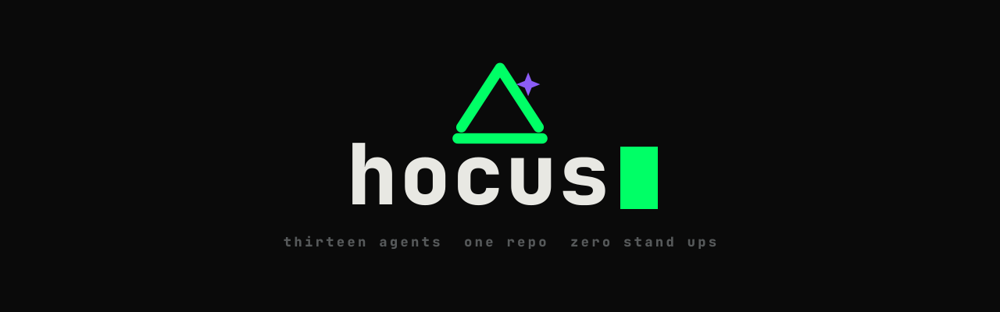

# Hocus

<p align="center">
  
</p>

A multi-agent harness generator and interactive command deck for AI coding tools. Write one persona once — a `SOUL.md` file — and compile it into native agent and rule formats for **Claude Code**, **OpenCode**, **Cursor**, and **Antigravity**.

The cast that ships with Hocus borrows wizard names from history and myth — Midas plans and founds, Roger Bacon orchestrates, Merlin plans, Flamel implements, Zoroaster reviews, and so on. Each persona also keeps aliases for the original *Silicon Valley* cast and an earlier occultist recast — toggle them on the dashboard with `?cast=valley` or `?cast=occult`. Rename or replace any persona — the harness doesn't care what an agent is called, only that it has a role, a voice, and a body of instructions.

---

## Interactive Command Deck (TUI)

Running `hocus` (or `hocus tui`) launches an interactive Terminal User Interface (TUI) command deck built for managing personas, tracking battle plans, chatting with agents, and monitoring repo compilation state.

```bash
hocus            # Launch interactive TUI deck
hocus --silent   # Launch directly, skipping the boot animation
```

### Deck Tabs & Navigation

Navigate between tabs using `Tab` / `Shift-Tab` or number keys `1`–`6`:

1. **Séance (Agent Chat Deck)**: Interactive prompt interface.
   - **Agent Switching**: Press `Tab` to cycle between active personas.
   - **Backend Selection**: Press `Ctrl+B` to cycle AI backends (Claude, Codex, Antigravity, custom).
   - **Autocomplete & Mentions**: Type `/` to trigger built-in commands and skills autocomplete; type `@` to mention repository files.
   - **Built-in Commands**: Execute `/status`, `/sync`, or package.json scripts directly from the chat prompt.
2. **Spells (Active Feature Plans)**: Track in-flight feature specifications, architectural blueprints, and step-by-step battle plans in `_spells/`.
3. **Souls (Persona Inspector)**: Browse installed `SOUL.md` personas in `.hocus/personas/`, inspect their metadata, view voice definitions, frontmatter schema validation, and triggers.
4. **Coven (Agent Topology)**: Visualize agent parent-child hierarchy graphs, delegation structures, and orchestrator relationships.
5. **Grimoire (Skill Management)**: View and manage open-standard `SKILL.md` files installed across `.agents/skills/` and `.claude/skills/`.
6. **Scrying (Stack Scanner & Compilation Status)**: Automated repository stack scanner detecting languages, frameworks, and build systems, paired with live compilation status for target AI tools.

---

## Why this exists

The four tools don't share a config format, but they've converged on common capabilities:

| Target | Where personas live | Notes |
|---|---|---|
| **Claude Code** | `.claude/agents/<slug>.md` | Markdown + YAML frontmatter, invoked via the Task tool or `@mention`. |
| **OpenCode** | `.opencode/agent/<slug>.md` | Same shape, different frontmatter keys (`mode: subagent`). |
| **Cursor** | `.cursor/rules/<slug>.mdc` | Cursor has no native subagent concept. Compiled as an "Agent Requested" rule instead — conditionally loaded by description, not directly invokable. |
| **Antigravity** | `.agents/rules/<slug>.md` | Antigravity's subagents are spawned dynamically by its orchestrator at runtime. This output is advisory context for that orchestrator, not a callable agent. |

Skills don't need a translation layer — `SKILL.md` is already a shared open standard. One file at `.agents/skills/<name>/`, mirrored to `.claude/skills/<name>/`, covers all four tools.

---

## Install

```bash
pnpm i -g @darkmagicstudios/hocus
# or: npm i -g @darkmagicstudios/hocus
```

This puts `hocus` on your `PATH`. Run `hocus init` in any repo to get started.

---

## Commands

### `hocus` / `hocus tui`

Launches the interactive TUI command deck.

```bash
hocus
hocus tui
hocus --silent     # skip boot animation
```

### `hocus init`

Run once in the repo where you want the harness. Writes main entrypoint files (`AGENTS.md`, `CLAUDE.md`, `PRODUCT.md`, `MEMORY.md`, `TASKS.md`, `_spells/`), copies the persona cast into `.hocus/personas/` for per-project editing, installs bundled skills, and spawns an interactive initialization session with the founder persona using your preferred agent CLI.

```bash
hocus init --name my-project
hocus init --claude             # use claude as agent runner (default)
hocus init --opencode           # spawn opencode instead of claude
hocus init --agy                # spawn agy (antigravity)
hocus init --antigravity        # alias for --agy
hocus init --agent agent        # spawn cursor agent runner
hocus init --agent custom-cli  # spawn a custom agent CLI
hocus init --dry-run           # preview files without writing to disk
```

### `hocus cast`

Scans the current repo for language and framework signals, tailors each persona with detected context, and compiles native formats for every detected target tool (or explicitly passed targets).

```bash
hocus cast
hocus cast --targets claude-code,opencode,cursor,antigravity
hocus cast --dry-run   # preview compiled outputs and target compilers
```

### `hocus add`

Adds agents and/or skills to selected AI tool provider(s) either locally in the current repository or globally in your home directory.

When run interactively without `--providers`, `hocus add` presents an interactive checkmark prompt to select target providers (**Claude Code**, **OpenCode**, **Cursor**, **Antigravity**).

```bash
# Add agent and/or skill locally to project (default scope)
hocus add --agent dinesh
hocus add -a gilfoyle -s atomic-commits -l

# Add agent and/or skill globally to home directory
hocus add --agent dinesh --global
hocus add -a dinesh -s atomic-commits -g

# Specify target providers directly (bypass checkmark prompt)
hocus add -a dinesh -s atomic-commits -g -p claude-code,cursor

# Install custom skill or persona from a local path
hocus add -s my-custom-skill --from ./path/to/skill
```

### `hocus skill add <name>`

Alias for `hocus add --skill <name> --local`. Installs a skill into target provider skill folders. Defaults to skills bundled with Hocus; pass `--from <path>` to install from a local path.

```bash
hocus skill add example-skill
hocus skill add db-migration-safety --from ../dms-skills/skills/db-migration-safety
```

### `hocus sync`

Fast refresh of `dashboard.html` from `.hocus/personas/` and `_spells/` without recompiling agent files.

```bash
hocus sync
hocus sync --name my-project
```

---

## Environment Variables

| Variable | Values | Description |
|---|---|---|
| `HOCUS_ASCII` | `1` | Degrades unicode glyphs, progress bars, and borders to plain ASCII for minimal terminals and CI runners. |

---

## The SOUL.md format

```markdown
---
character: gilfoyle        # lowercase, hyphenated slug (stable across recasts)
display_name: Zoroaster
role: reviewer
voice: cold, precise, contemptuous of inefficiency
glyph: "(o)"                # short badge, shown on the dashboard
                            # /^\ is the Hocus brand mark (see src/theme.ts), not a persona glyph
aliases:                    # optional — used by dashboard
  valley: Gilfoyle           # ?cast=valley
  occult: Mephisto           # ?cast=occult
triggers:
  - code review
  - pull request
tools: [read, grep, bash]   # optional, defaults to read/grep/glob
model: claude-sonnet-4-6    # optional
---

# Zoroaster — Reviewer

The body is the persona's actual instructions — responsibilities,
boundaries, voice. This is what gets compiled into each target's native
format.
```

Validated against the schema in `src/schema/soul.ts` before compilation — malformed `SOUL.md` files are rejected with specific schema field errors.

---

## Local Development

```bash
npm install
npm run build
npm link          # links `hocus` globally
npm run dev       # run directly via tsx
npm run test      # run unit test suite
npm run typecheck # run TypeScript check
```

---

## Directory Layout

```
src/
├── cli.ts                  # CLI entrypoint & commander configuration
├── commands/               # init, cast, skill add, sync handlers
├── personas/               # bundled SOUL.md cast (13 personas)
├── schema/                 # SOUL.md & spell frontmatter validation schemas
├── compilers/              # target compilers (claude-code, opencode, cursor, antigravity)
├── scanners/               # repository tech stack detection engine
├── templates/              # main file templates & HTML dashboard renderer
├── tui/                    # interactive Ink/OpenTUI command deck & tabs
│   ├── tabs/               # Séance, Spells, Souls, Coven, Grimoire, Scrying
│   ├── chat/               # prompt engine, slash commands, mentions
│   └── boot/               # boot animation & theme definitions
└── utils/
skills/                     # starter skills bundled with Hocus
tests/                      # test suite
```

---

## Known Issues

- **OpenCode directory convention**: Default compiler output is `.opencode/agent/`. Check live OpenCode configuration if `.opencode/agents/` is required by your build.
- **Antigravity output**: Output is advisory context for Antigravity's orchestrator; Antigravity handles runtime subagent spawning dynamically.

---

## License

MIT © Dark Magic Studios

